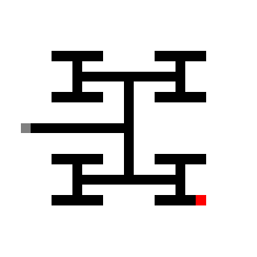
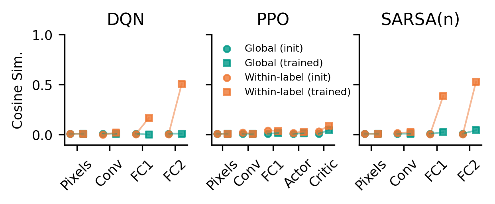
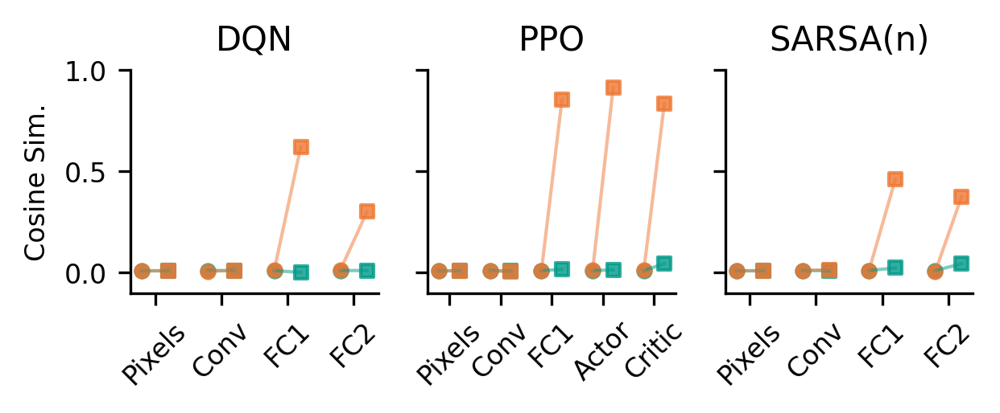
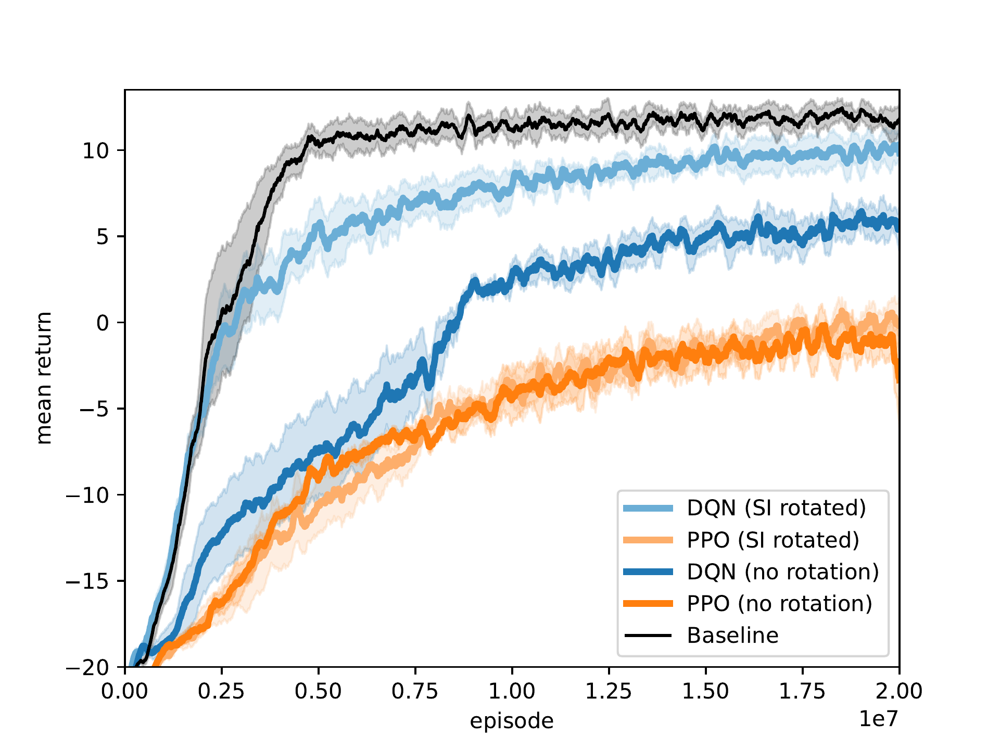
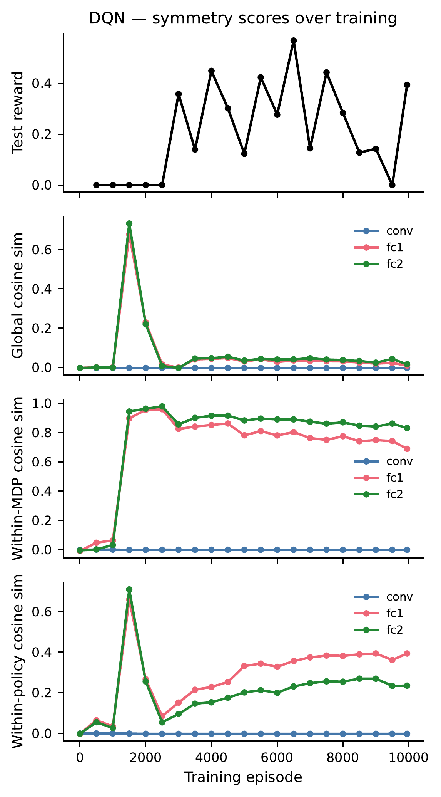
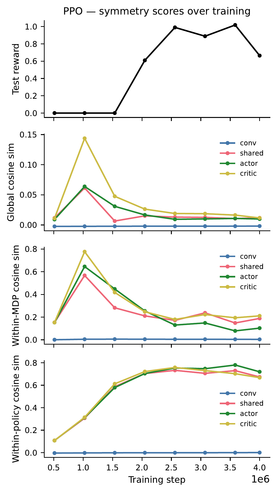

# SARSA(n) on the Gridworld: Isolating the Learning Objective

Reviewers noted that DQN and PPO differ along many axes (value-based vs. policy-gradient, off-policy vs. on-policy, replay buffer vs. none). To isolate which property drives the representational differences, we add **Deep SARSA(n)** — on-policy like PPO but value-based like DQN.

Random start positions are necessary for this analysis: with a fixed start, the agent only ever visits states along a single trajectory to the goal, so representations for most of the state space are never trained and the RSA comparison is not meaningful. DQN and PPO both learn reliably with random starts on the original depth-6 maze, but SARSA(n) does not — its on-policy, single-pass updates (no replay buffer) make it much harder to propagate value information when the starting position varies across episodes. To get SARSA(n) working with random starts we (1) reduced the maze from depth 6 to depth 4 (25x25) and (2) added potential-based reward shaping (BFS distance to goal). All three algorithms were retrained on this smaller maze for a fair comparison.

  

## RSA Results

Cosine similarity within MDP homomorphism equivalence classes (orange) vs. global baseline (teal), at init (circles) and after training (squares).

### MDP Homomorphism Symmetry

  

### Policy Symmetry

  

### Summary

| Property | DQN | PPO | SARSA(n) |
|---|---|---|---|
| Learning objective | Value-based (TD) | Policy gradient | Value-based (TD) |
| Data collection | Off-policy (replay) | On-policy | On-policy |
| MDP symmetry | **Yes** | No | **Yes** |
| Policy symmetry | Weak | **Yes** | Weak |

SARSA(n) patterns with DQN despite sharing PPO's on-policy data collection, confirming that the learning objective — not the data collection strategy — is the primary driver of which symmetries are encoded.

# Rebuttal Figures

## Transfer with State-Invariant Representations

Mean return comparison between agents trained with and without SI-rotated observations.

## Symmetries Over Training

Cosine similarity metrics (global, within-MDP, and within-policy) tracked across layers during training.

### DQN

### PPO

